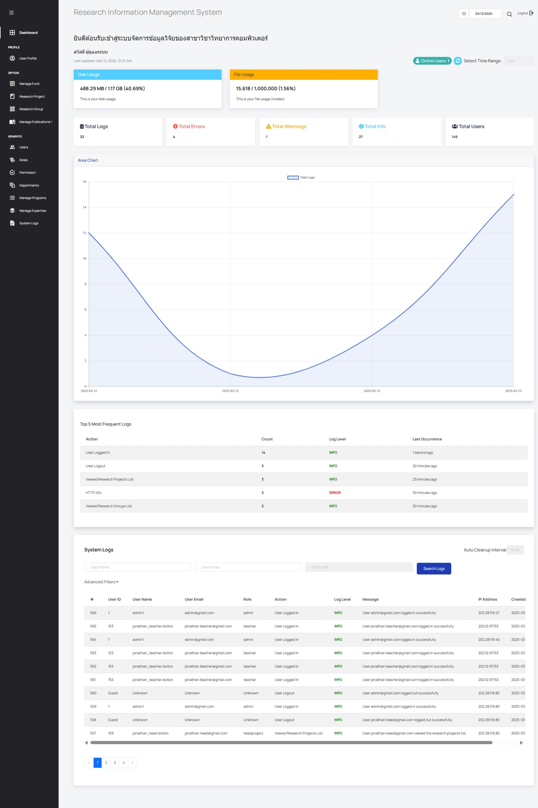

# 📖 คู่มือการใช้งาน (User Manual)

## เลือกภาษา (Select Language)
- [ไทย](#คู่มือการใช้งาน-ภาษาไทย)
- [English](#user-manual)

---

## คู่มือการใช้งาน ภาษาไทย
## สารบัญ
1. [ข้อมูลเบื้องตัน](#ข้อมูลเบื้องตัน)
2. [ข้อมูล Sprint#2](#ข้อมูล-sprint1)
3. [วิธีการใช้งานสำหรับผู้ดูแลระบบ](#วิธีการใช้งานสำหรับ-admin)

## ข้อมูลเบื้องตัน
คู่มือการใช้งานสำหรับ Sprint#2 สำหรับผู้ดูแลระบบ

## ข้อมูล Sprint#1
- ในฐานะผู้ดูแลระบบ ฉันต้องการแดชบอร์ดสำหรับบันทึกกิจกรรมของผู้ใช้ บันทึกข้อผิดพลาด และบันทึกข้อมูลระบบที่สำคัญ

## วิธีการใช้งานสำหรับผู้ดูแลระบบ
### คลิกที่ปุ่ม login ในหน้า [homepage](https://cs040268.cpkkuhost.com/)

### 1. ใส่ **username** และ **password** ด้วยบัญชีผู้ดูแลระบบ

### 2. หลังจาก login สำเร็จจะมายังหน้าแดชบอร์ด

### 3. โครงสร้าง Dashboard แบ่งออกเป็น 4 ส่วนหลัก

#### 3.1 พื้นที่เก็บข้อมูลและการเลือกช่วงเวลา
- **Disk Usage**: พื้นที่เก็บข้อมูลที่ใช้งานเทียบกับพื้นที่ทั้งหมดของเซิร์ฟเวอร์  
- **File Usage (Inodes)**: จำนวนไฟล์และโฟลเดอร์ที่ใช้งานเทียบกับขีดจำกัดของเซิร์ฟเวอร์  
- **Select Time Range**: สามารถเลือกช่วงเวลาที่ต้องการได้ ซึ่งจะมีผลกับข้อมูลในแดชบอร์ดส่วนอื่น ๆ  

#### 3.2 สรุปบันทึกระบบ (Logs Summary)
- **Total Logs**: จำนวนบันทึกทั้งหมดของระบบ  
- **Total Errors**: แสดงจำนวนข้อผิดพลาดในระบบ
- **Total Warnings**: คำเตือนที่อาจส่งผลกระทบ แต่ยังไม่ใช่ข้อผิดพลาด เช่น การกรอกรหัสผ่านผิด 
- **Total Info**: ข้อมูลทั่วไปเกี่ยวกับการทำงานของระบบ เช่น การเข้าสู่ระบบ
- **กราฟแสดงข้อมูล** สามารถคลิกที่แต่ละการ์ดเพื่อดูกราฟของประเภทบันทึกที่ต้องการ  

#### 3.3 บันทึกที่พบบ่อยที่สุด (Top 5 Logs)
- แสดง **5 อันดับเหตุการณ์ที่เกิดขึ้นบ่อยที่สุดในระบบ**  
- ตัวอย่าง: "User Logged In" เป็นเหตุการณ์ที่เกิดขึ้นบ่อยที่สุด ดังรูป

#### 3.4 ตารางบันทึกระบบทั้งหมด (Full Log Table)
- **ช่วงเวลาล้างข้อมูลอัตโนมัติ (Auto Cleanup Interval)**: สำหรับเลือกช่วงเวลาที่ต้องการให้ระบบลบข้อมูลบันทึกโดยอัตโนมัติ 
- สามารถค้นหาข้อมูลโดยใช้ **User Name, User Email, Log Level**  
- มีตัวเลือก **Advanced Filters** สำหรับค้นหาโดยใช้ **Action หรือ IP Address** 

---

# User Manual

## Table of Contents
1. [Basic Information](#basic-information)
2. [Sprint#2 Details](#sprint1-details)
3. [How to Use for Admin](#how-to-use-for-admin)

## Basic Information
This is a user manual for Sprint#2 for admin.

## Sprint#2 Details
-  As an admin, I want a dashboard of the user's activity log, error log, and important system information log.

## How to Use for Admin
#### Clink login button on [homepage](https://cs040268.cpkkuhost.com/)

### 1. Enter **username** and **password** with an Admin account.

### 2. After successful login, you will be redirected to the Dashboard.

### 3. Dashboard Structure Divided into 4 Main Sections

#### 3.1 Storage and Time Range Selection
- **Disk Usage**: Displays the storage used compared to the total available space on the server.  
- **File Usage (Inodes)**: Shows the number of files and folders used compared to the server limit.  
- **Select Time Range**: Allows users to choose a time range, affecting the data displayed in other dashboard sections.  

#### 3.2 Log Summary
- **Total Logs**: The total number of system logs recorded.  
- **Total Errors**: Shows the total system errors.
- **Total Warnings**: Displays warnings that may impact the system but are not critical errors, such as incorrect password attempts.  
- **Total Info**: General system activity logs, such as login attempts. 
- **Graphical Representation**: Users can click on each card to view specific log level graphs.  

#### 3.3 Most Frequent Logs (Top 5 Logs)
- Displays the **top 5 most frequently occurring events** in the system.  
- Example: "User Logged In" might be the most frequent event, as shown in the image.

#### 3.4 Full Log Table
- **Auto Cleanup Interval**: Select a predefined interval for automatic log deletion.
- Allows searching logs by **User Name, User Email, Log Level**.  
- **Advanced Filters** enable searching by **Action or IP Address**.  

